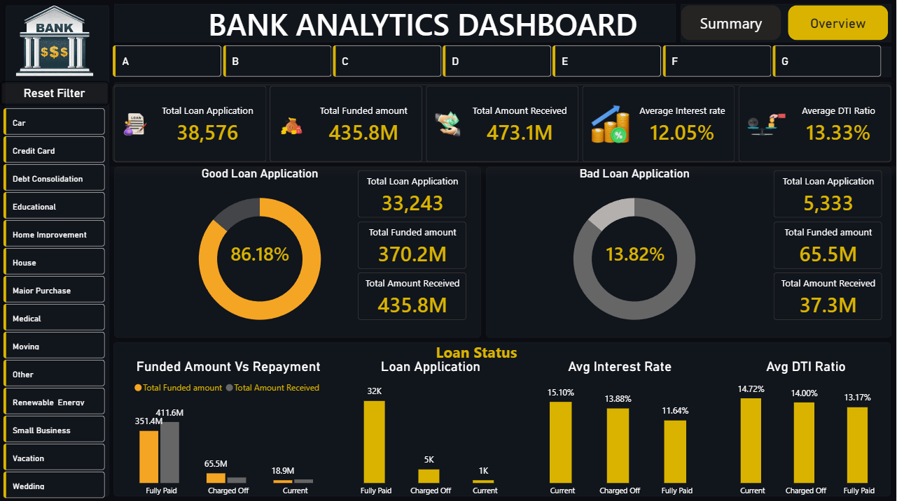
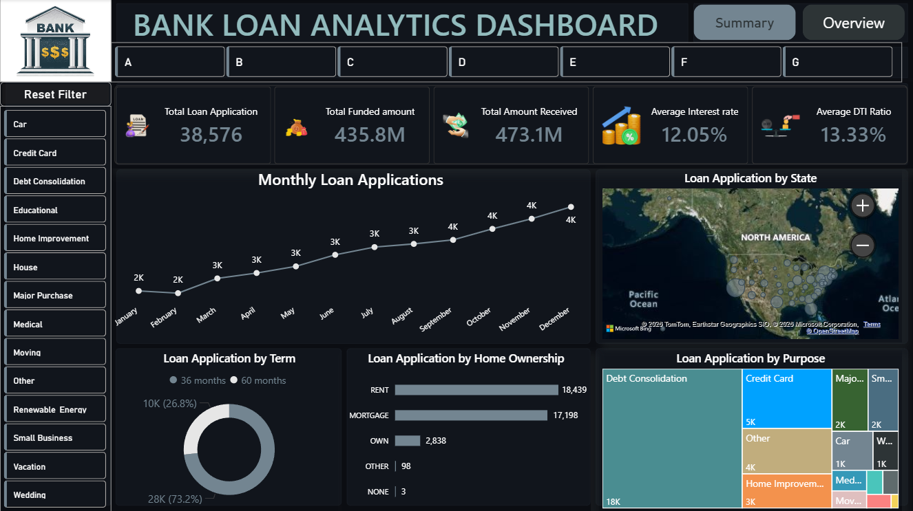

# Bank Analytics Dashboard - Power BI
## Project Overview
This project presents a comprehensive Bank Loan Analytics Dashboard built using Power BI. The dashboard provides insights into loan applications, funded amounts, repayments, interest rates, debt-to-income ratios, and customer loan behavior.
---
## Dashboard Features
### Summary Dashboard
- Good Loan vs Bad Loan Analysis
- Funded Amount vs Amount Received
- Loan Status Analysis
- Average Interest Rate
- Average DTI Ratio
### Overview Dashboard
- Monthly Loan Applications Trend
- Loan Applications by State
- Loan Applications by Purpose
- Loan Applications by Home Ownership
- Loan Applications by Loan Term
---
## Key Insights
- Total Loan Applications: 38,576
- Total Funded Amount: 435.8M
- Total Amount Received: 473.1M
- Good Loan Percentage: 86.18%
- Bad Loan Percentage: 13.82%
---
## Tools & Technologies Used
- Power BI
- DAX
- Power Query
- Excel / CSV Dataset
---
## Project Structure
```bash
Dashboard/
Dataset/
Images/
README.md
```
---
## Dashboard Screenshots

### Summary Dashboard


### Overview Dashboard

---
## How to Use
1. Download the `.pbix` file
2. Open using Power BI Desktop
3. Refresh the dataset if required
4. Explore interactive visualizations
---
## Author
Harshith Narayan N
